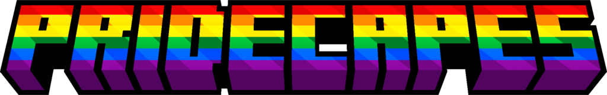

Pride Cape Flags
=======

This mod adds different pride flags to the game, you can wear these as capes. It can be installed on either server or client, however, the capes will only show if the user has this mod installed. To change what pride flag you have, go into the mod configs, and type the texture location for the new flag, for any built-in flags, these will be shown alongside the images in the section below.

Available Flags:
============
Rainbow (pridecapeflags:pride)

Gay Men (MLM) (pridecapeflags:gay)

Lesbian (pridecapeflags:lesbian)

Bi (pridecapeflags:bi)

Pan (pridecapeflags:pan)

Ace (pridecapeflags:ace)

Aro (pridecapeflags:aro)

Non-Binary (pridecapeflags:enby)

Trans (pridecapeflags:trans)

Transfem (pridecapeflags:transfem)

Transmasc (pridecapeflags:transmasc)

How to add your own pride flag
====
It is simple to add your own pride flag, it can be done through a simple resource pack. Any player that doesn't have the same resource pack, they will not see the cape.

Create a folder within a custom namespace in the assets folder called "flags", in here you can drop any texture to be used as a cape. These will be available to be used in-game by going to settings and typing namespace:texture name, do make sure to ommit the .png file extension.
